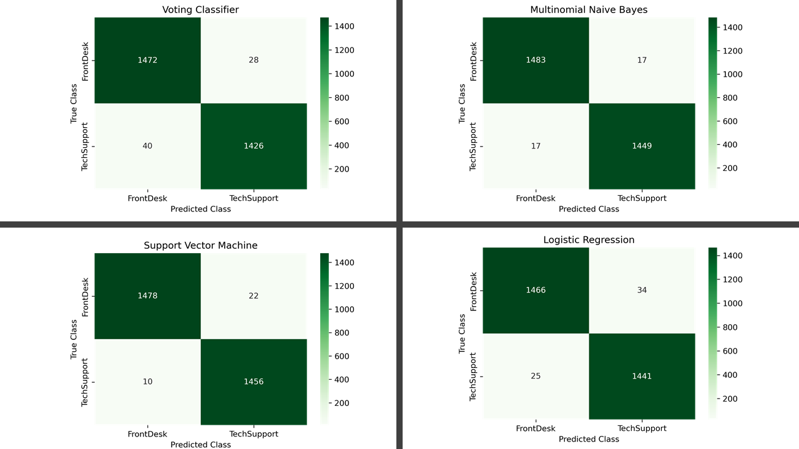

# Comparing Performance Metrics of Four Classifiers on Labeling Text Data

### Introduction

A significant portion of data that exists in the world today is in the form of text that is written by humans to communicate with other humans. Since computers cannot understand human language, they cannot be used to process or analyze this text. **Natural language Processing** (NLP) is a field of linguists and computer science that uses computational tools that allow computers to analyse human language. NLP is used with machine learning classifiers to analyse human language data. This study aims to compare a handful of machine learning classifiers in thier ability to classify text data into the appropriate category. 

### Data

The data for this study was obtained from Reddit using the [Pushshift API](https://github.com/pushshift/api). The API was used to scrape the contents of posts on two subreddits: [r/TalesFromTheFrontDesk](https://www.reddit.com/r/TalesFromTheFrontDesk/) and [r/talesfromtechsupport](https://www.reddit.com/r/talesfromtechsupport/). These two subreddits were chosen since they are quite distinct in many ways, but also have in common the over-arching theme of stories of experiences in the service industry. This allowed me to use the data either as is, giving the models very distinct key-words that can be used to distingush between the two groups, or, with subreddit-specific keywords removed, making the two groups more similar. 

### Models

The models I tested in this study are: 
1. **Logistic Regression Classifier** 
    which classifies an obervation based on its probability of belonging either to one class or the other.     
2. **Multinomial Naive Bayes Classifier** 
    which uses the Naive Bayes theorem to determine which class an observation belongs to  
3. **Support Vector Machine**
    which identifies the optimum decision boundary in a multi-dimensional feature space to classify observations
4. **Voting Classifier**
    which is an ensemble classifier that used an Ada Boost Classifier, a Gradient Boosting Classifier and a Logistic regression Classifier to contribute their votes for the final prediction of each observation. 

None of these models can process text data as is. Text data must first be converted in an appropriate numerical form using NLP tools that are referred to as transformers. The models were tested with two transformers, **Count Vectorizer** and **TF-IDF Vectorizer**, to find the combination that worked best.

### Methodology

#### Data Acquisition and Cleaning
I acquired from two subreddits: [r/TalesFromTheFrontDesk](https://www.reddit.com/r/TalesFromTheFrontDesk/) and [r/talesfromtechsupport](https://www.reddit.com/r/talesfromtechsupport/) using [Pushshift API](https://github.com/pushshift/api). I pulled around 5000 posts from each subreddit using a custom function that used the API to scrape posts in batches of 100 going back in time. Since many posts were either deleted or removed, especially from r/talesfromtechsupport, the function also checked for `[removed]`, or `[deleted]` tags and dropped those observations from the output dataframe. The final count of posts from the subreddits were 4999 from r/TalesFromTheFrontDesk and 4886 from r/talesfromtechsupport. 

I then binarized the subreddit names to 0 for TalesFromTheFrontDesk and 1 for talesfromtechsupport, and split the data into train and test sets with a test size of 30%. 

#### Gridsearching Through Model Hyperparameters
I used a pipeline and gridsearching to find the best parameters optimized for recall score for the following combinations of transformer and model:
1. Logistic regression Classifier with Count Vectorizer
2. Logistic Regression Classifier with TF-IDF Vectorizer
3. Support Vector Machine with Count Vectorizer
4. Support Vector Machine with TF-IDF Vectorizer
5. Multinomial Naive Bayes Classifier with Count Vectorizer
6. Voting Classifier with Count Vectorizer

#### Testing Best Estimators
Once the best estimator and transformer combination with optimized hyperparameters were determined, I tested them on data that was less distinct than the original full dataset. In order to create more overlap between the two classes of posts, I found the top 50 most frequently used words in both groups, and then determined what terms were present in the top 50 for each group that were missing from the other group. I then added these two sets of unique words totalling 42 words (21 from each group) to english stopwords. This new set of stop words were removed form the posts by the vectorizer. The dataset with no key words removed will be referred to as the _full dataset_, whereas the dataset with unique key words removed will be referred to as the _modified dataset_.

------------------------------
#### Results

**Model performance when trained on full dataset**
All models tested did really well in classifying posts into the corerct subreddit. SVM-Tvec (Support Vector Machine with Tfidf Vectorizer) did the best followed by Multinomial Naive Bayes, as shown in the table below. From these, I selected SVM_TVec, MNBayes, LogReg_TVec and VotingC to be tested for performance on classifying the modified dataset. 

Model|Accuracy|Recall|Precision
-----|--------|------|---------
SVM-TVec|0.988874|0.990450|0.987084
MNBayes|0.988537|0.987722|0.989071
VotingC|0.988537|0.993179|0.983784
LogReg-TVec|0.988200|0.991132|0.985085
LogReg-CVec|0.986514|0.986357|0.986357
SVM-CVec|0.982131|0.984993|0.978983

**Model performance when trained on the modified dataset**

SVM and MNBayes did the best when trained on the modified dataset with unique key words removed. The performance of LogReg and VotingC dropped when these identifying key words were missing. 

Model|Accuracy|Recall|Precision
-----|--------|------|----------
SVM|0.989211|0.993179|0.985115
MNBayes|0.988537|0.988404|0.988404
LogReg|0.980108|0.982947|0.976949
VotingC|0.977073|0.972715|0.980743

Confusion matrices for the models trained on the modified dataset.

#### Conclusion and Future Directions

Overall Support Vector Machine and Multinomial Naive Bayes Classifiers did the best with both datasets. However Multinomial Naive Bayes had a shorter runtime and a more balanced number of false classifications between the two classes.  

#### Contents of Repository
 `code/` : contains all the codes that were written for analysis. The notebooks are numbered in order of use. Data gets saved into the 'data/' folder at the end of each notebook so that it can be imported and used in the next one.  
 
 `data/` : contains all the raw data that was pulled from reddit using PushShift API and the datasets pulled using PRAW API. The code used to import usinf PRAW is in the `code/` folder.  
 
 `figures/` : contains all the figures generated using the notebooks. It also contains all the confusion matrics produced form the different models trained and tested. 
 
 `DSIR Project 3.pdf` is a slide deck of the project. 
 
